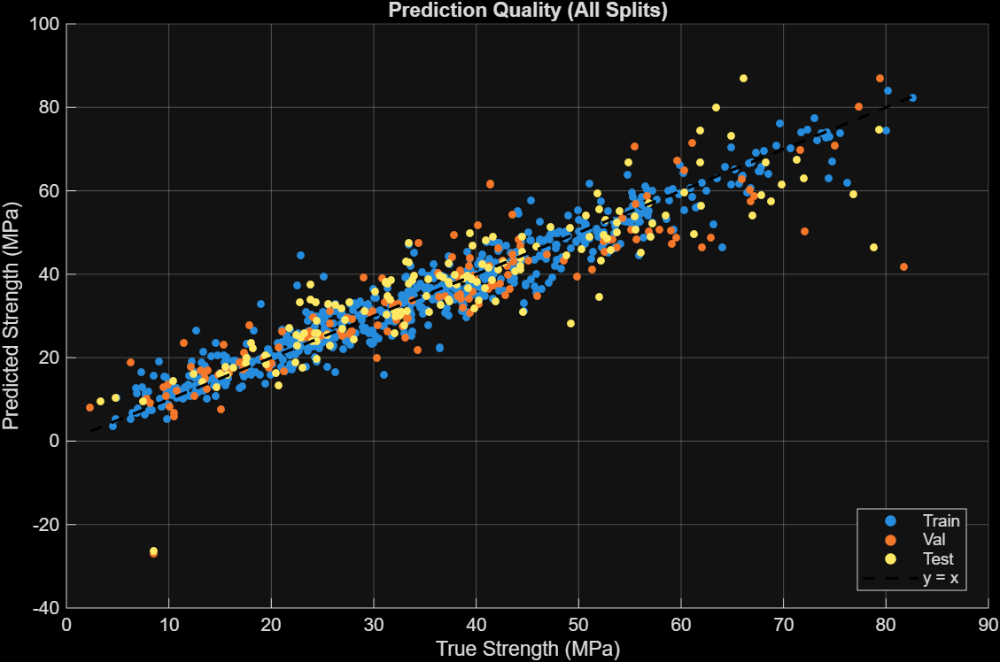
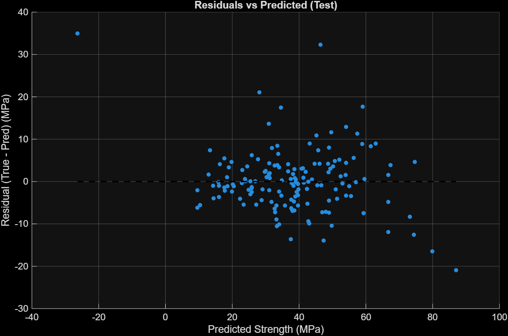
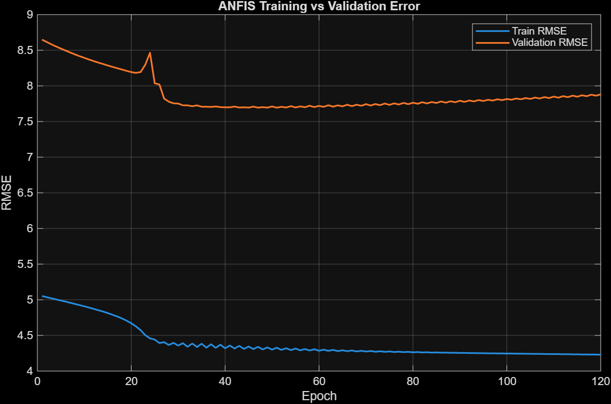
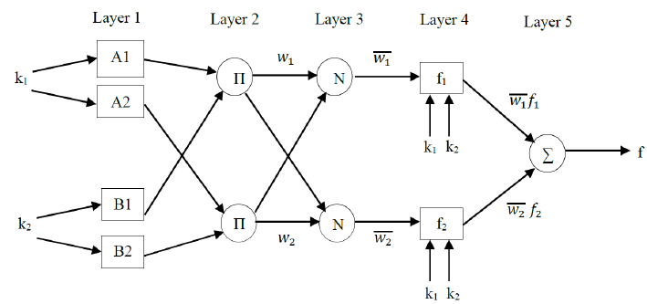

# ANFIS ile Beton Basınç Dayanımı Tahmini (MATLAB)

Karışım oranları ve kürlenme süresi verilerinden **beton basınç dayanımını (MPa)** tahmin etmek için **klasik bir ANFIS (Adaptive Neuro‑Fuzzy Inference System / Uyarlamalı Nöro‑Bulanık Çıkarım Sistemi)** hattını uygulayan proje.

Projenin amacı:
- Temiz bir regresyon iş akışı kurmak (eğitim/doğrulama/test ayrımı, sızıntısız (leakage-free) ön işleme),
- MATLAB’de Sugeno tipi bir ANFIS modelini eğitmek ve değerlendirmek,
- Eğitilmiş modelleri tekrarlanabilir şekilde dışa aktarmak/yeniden yüklemek.


## Problem

Karışım bileşenleri ve **yaş** bilgisinden **beton basınç dayanımını** tahmin etmek. İlişki **yüksek derecede doğrusal olmayan** (highly nonlinear) bir yapıdadır.


## Veri Kümesi

Bu proje **UCI Concrete Compressive Strength** veri kümesini kullanır (1030 örnek, 8 input değişkeni, 1 target).  
- Kaynak (UCI): https://archive-beta.ics.uci.edu/dataset/165/concrete%2Bcompressive%2Bstrength  
- Lisans: **CC BY 4.0** (atıf zorunlu)

### Değişkenler (kanonik)
- Cement, Blast Furnace Slag, Fly Ash, Water, Superplasticizer, Coarse Aggregate, Fine Aggregate (kg/m³)
- Age (gün)
- Hedef: Concrete compressive strength (MPa)

### Modelde fiilen kullandıklarım
ANFIS kural tabanını yönetilebilir tutmak için (grid partitioning kural sayısını hızla şişirebilir) bu çalıştırmada **5 girdi** kullanıldı:

- Cement (kg/m³)
- Water (kg/m³)
- Age (gün)
- Superplasticizer (kg/m³)
- Blast Furnace Slag (kg/m³)

Target:
- Concrete compressive strength (MPa)


## Yöntem

### ANFIS yapılandırması (Sugeno tipi)
- Başlangıç FIS: **grid partition** (`genfis1` varsa, yoksa `genfis(GridPartition)`)
- Girdi üyelik fonksiyonları: **Gauss (`gaussmf`)**
- Girdi başına üyelik fonksiyonu sayısı: **2**
- Kullanılan girdi sayısı: **5**
- Yaklaşık kural sayısı: **2^5 = 32 kural**
- Çıkış MF: **lineer** (birinci dereceden Sugeno)

### Eğitim kurulumu
- Veri bölme: **%70 train / %15 validation / %15 test**
- Ön işleme: **min–max ölçekleme yalnızca train üzerinde fit edilir** (val/test’e train ölçekleyicisi uygulanır)
- Eğitim: `anfis`, `ValidationData` açık, **120 epoch**
- Tekrarlanabilirlik: sabit rastgele tohum (**42**)

## Sonuçlar
Her bölme üzerinde hesaplanan metrikler (MPa):

- TRAIN: RMSE=4.3397, MAE=3.1558, R2=0.9312
- VAL: RMSE=7.6945, MAE=5.2297, R2=0.8083
- TEST: RMSE=7.3726, MAE=5.0972, R2=0.7946

**Yorum:**
- Belirgin bir genelleme farkı var (train RMSE ile test RMSE), dolayısıyla model mükemmel biçimde düzenlenmiş (regularized) değil.
- Doğrulama hatası erken epoch’lardan sonra düzleşme / hafif artma eğiliminde → erken durdurma (early stopping) muhtemelen faydalı olur.


## Figürler
Grafiklerinizi `figures/` altına koyun (aşağıdaki önerilen dosya adlarıyla):


### Tahmin Kalitesi (Tüm Bölmeler)


### Artıklar (Residuals) vs Tahmin (Test)


### ANFIS Öğrenme Eğrileri (Train vs Validation RMSE)



## Repo yapısı

```
.
├── src/
│   └── main.m
├── models/
│   ├── anfis_concrete_model.fis
│   └── anfis_concrete_model.mat
├── figures/
│   ├── predicted_vs_true.png
│   ├── residuals_test.png
│   └── learning_curves.png
├── data/               # optional (see note below)
│   └── Concrete_Data.xls
└── README.md
```


## Nasıl çalıştırılır

### Gereksinimler
- MATLAB + **Fuzzy Logic Toolbox** (fonksiyonlar: `anfis`, `genfis1` / `genfis`, `evalfis`)

### Adımlar
1. Veri kümesini indirin (yukarıdaki UCI bağlantısı) ve şu şekilde yerleştirin:
   - repo kök dizinine `Concrete_Data.xls` **veya**
   - `data/Concrete_Data.xls` ve `main.m` içindeki `CFG.DATA_FILE` değerini güncelleyin.

2. Çalıştırın:
```matlab
cd src
main
```

Script şunları yapar:
- veri kümesini okur,
- train/val/test ayırır,
- sızıntısız (leakage-free) bir ölçekleyiciyi train üzerinde fit eder,
- başlangıç FIS’ini üretir,
- ANFIS’i eğitir,
- RMSE/MAE/R² metriklerini yazdırır,
- eğitilmiş modelleri kaydeder:
  - `anfis_concrete_model.mat` (FIS + ölçekleyici + meta veri)
  - `anfis_concrete_model.fis` (taşınabilir FIS)


## Model dışa aktarma & yeniden yükleme (neler dahil)

- `.mat` şunları içerir: eğitilmiş FIS, ölçekleyici parametreleri, seçilen girdiler ve metrikler.
- `.fis` taşınabilir bir FIS dosyasıdır; `readfis` ile yeniden yükleyebilirsiniz.

Script ayrıca, yeniden yüklenen modellerin tutarlı tahmin ürettiğini doğrulamak için küçük bir “reload demo” bölümü içerir.


## Sınırlılıklar / sonraki adımlar

Bunu daha güçlü bir portföy parçasına dönüştürseydim:
- karşılaştırma için **baseline modeller** (doğrusal regresyon, random forest, gradient boosting) eklerdim,
- **k-fold cross-validation** uygulardım (tek bir rastgele bölme yanıltabilir),
- **MF sayısı / MF tipi / girdi alt kümesi** ayarlarını sistematik biçimde optimize ederdim,
- en iyi doğrulama epoch’unda **erken durdurma** uygulardım,
- **fiziksel olmayan tahminleri** (örn. negatif MPa) inceler ve kısıt/transform uygulardım.


## Kaynaklar
- J.-S. R. Jang, “ANFIS: Adaptive-Network-based Fuzzy Inference System,” *IEEE Transactions on Systems, Man, and Cybernetics*, 1993.
- UCI Machine Learning Repository: Concrete Compressive Strength (CC BY 4.0): https://archive-beta.ics.uci.edu/dataset/165/concrete%2Bcompressive%2Bstrength
- MATLAB dokümantasyonu: `anfis`, `genfis1`, `genfis` (Fuzzy Logic Toolbox)


## ANFIS Mimarisi


## Ek Bilgi

* **Geliştirici**: [Fatih AYIBASAN] (Bilgisayar Mühendisliği Öğrencisi)
* **E-posta**: [fathaybasn@gmail.com]

---
